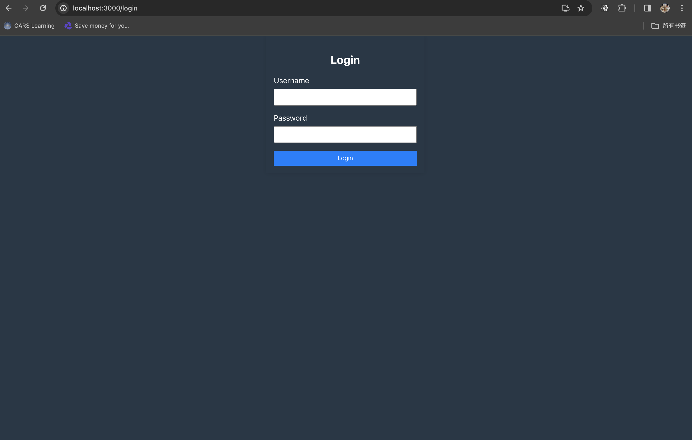
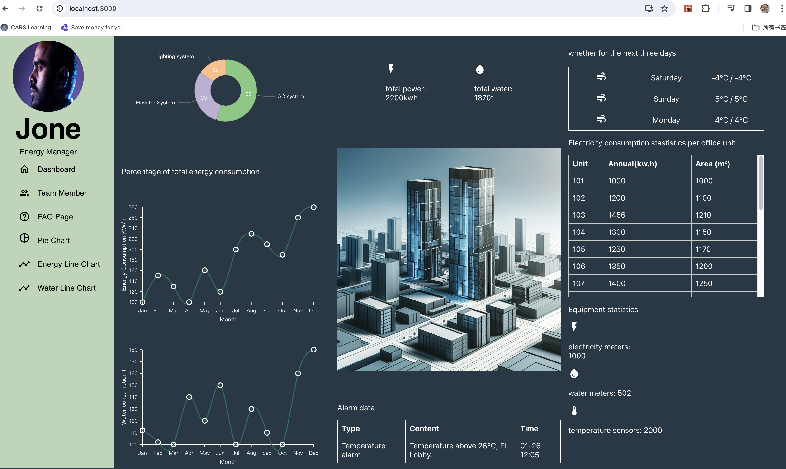
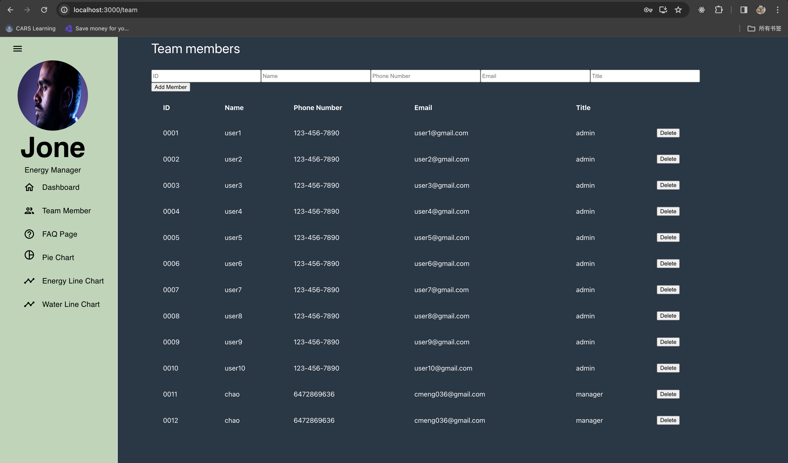
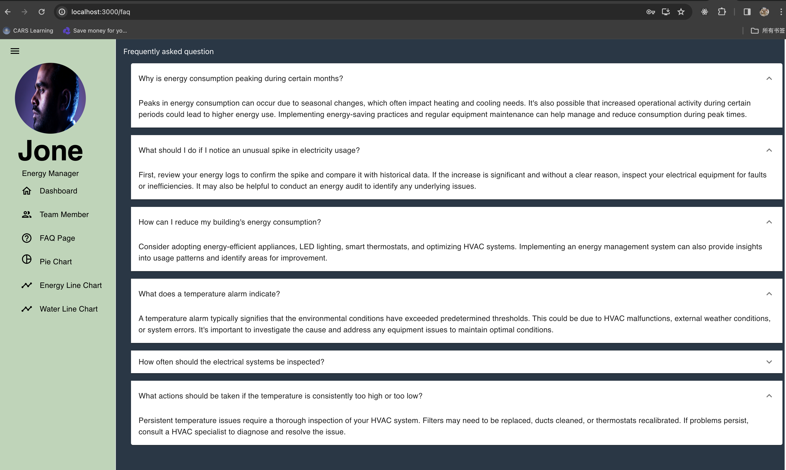
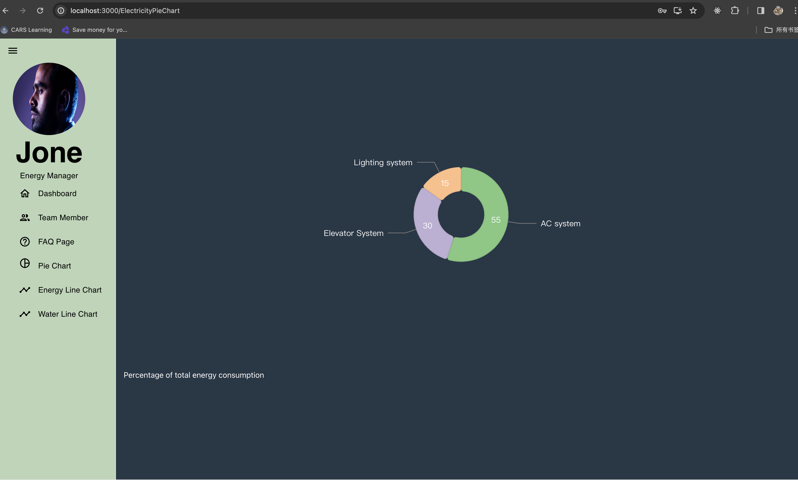
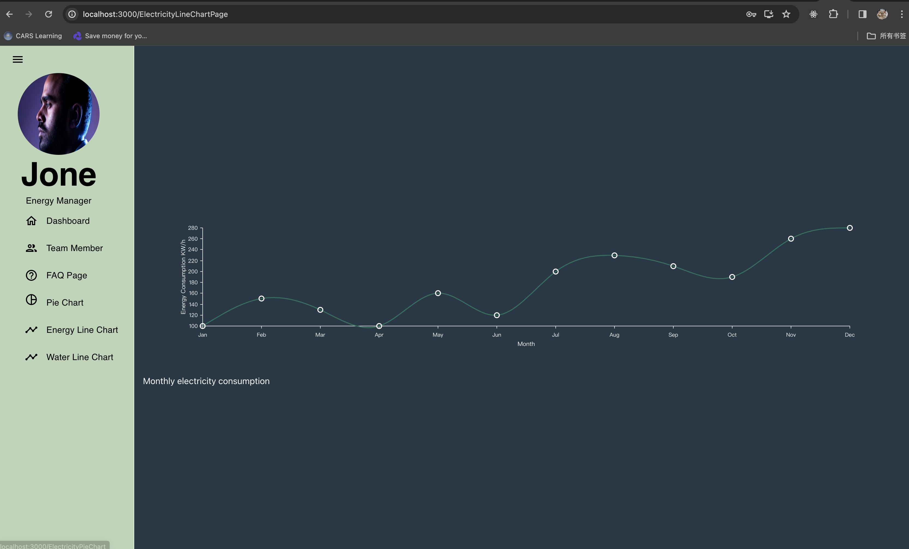

# Project Title

## Overview

This project aims to develop a prototype of a smart building management system, which uses simulated data to
demonstrate the building's energy usage and environmental control capabilities. The focus will be on creating
an intuitive, interactive front-end user interface, along with a simplified back-end for processing and displaying
data.

### Problem

Why is your app needed? Background information around any pain points or other reasons.

1. **Energy Efficiency and Cost Reduction**: Commercial buildings often face the challenge of high energy consumption,
   leading to increased operational costs and environmental impact. This app addresses the need for efficient energy management
   by providing real-time monitoring and control over energy usage, helping to reduce costs and promote sustainable practices.

2. **Environmental Control and Comfort**: Ensuring a comfortable working or living environment within buildings is crucial.
   The app's ability to monitor and adjust environmental parameters like temperature, lighting, and ventilation directly impacts
   the comfort and wellbeing of the occupants. It also contributes to healthier indoor air quality.

3. **Data-Driven Decisions**: Building managers and owners currently lack detailed and intuitive access to energy and environmental
   data. The app fulfills this gap by offering comprehensive data visualization and analysis tools. This feature enables more informed
   decision-making regarding building maintenance, upgrades, and energy usage.

4. **Increased Demand for Smart Building Technologies**: There's a growing trend in integrating smart technologies into building
   infrastructure. This app aligns with the demand for smart solutions that offer automation, efficiency, and ease of management in the
   real estate sector.

5. **Regulatory Compliance and Reporting**: With increasing regulations on energy consumption and environmental standards, there's
   a need for systems that can help ensure compliance. The app can track and report on various parameters, making it easier for businesses
   to adhere to legal requirements and standards.

6. **Remote Monitoring and Accessibility**: In the modern digital era, the ability to remotely monitor and control building systems is
   essential. This app offers convenience and accessibility, allowing building managers to oversee operations from anywhere, reducing the
   need for on-site inspections and adjustments.

7. **Customization and User-Friendly Interface**: One major pain point in existing systems is the lack of user-friendly interfaces and
   customization. This app addresses this issue by providing an intuitive, easy-to-navigate interface, tailored to the specific needs of the users.

### User Profile

Who will use your app? How will they use it? Any special considerations that your app must take into account.

Building Managers and Owners: They are the primary users who will use the app for the overall management of the building's energy systems,
environmental controls, and maintenance planning. They will rely on the app for monitoring energy consumption, controlling environmental
settings, and making decisions about building operations.

Sustainability Managers: In organizations where sustainability goals are a priority, these users will use the app to track and report on
energy efficiency and sustainability metrics.

Tenants or Employees (in some cases): In certain building setups, especially in office spaces, tenants or employees might have limited
access to the app for controlling personal space settings or viewing environmental conditions.

How They Will Use It

Monitoring and Reporting: Users will monitor real-time data on energy consumption, water usage, future weather, etc.

Environmental Controls: Adjusting settings for heating, cooling, lighting, and ventilation to optimize comfort and efficiency.

Data Analysis: Using historical data and trends for strategic planning and operational improvements.

Special Considerations

User Access Levels: Implementing different access levels to ensure users only see and interact with data and controls relevant to their roles.
For instance, building managers would have comprehensive access, while tenants might have limited access.

Data Security and Privacy: Ensuring the security of sensitive data, especially if the app handles tenant information. Compliance with data
protection regulations is crucial.

Ease of Use: Designing an intuitive user interface, considering not all users may be tech-savvy. The UI/UX should simplify complex data and
provide a clear navigation pathway.

Integration Capability: Ability to integrate with existing building management systems and IoT devices, ensuring seamless operation and data
synchronization.

Scalability: The app should be scalable to accommodate different sizes and types of buildings and adaptable to future technological advancements.

Customization: Providing options for customization to meet the specific needs of different buildings and user preferences.

Reliability and Uptime: Ensuring the app’s reliability

### Features

List the functionality that your app will include. These can be written as user stories or descriptions with related details. Do not describe _how_ these features are implemented, only _what_ needs to be implemented.

\*\*Real-Time Energy Monitoring

As a building manager, I want to monitor real-time energy usage (electricity, water, gas) across the building, so that I can identify patterns and optimize usage.
Environmental Control Management

As a user, I need to adjust environmental settings like temperature, lighting, and ventilation remotely, ensuring optimal comfort and energy efficiency.

\*\*Historical Data Analysis

As a facility manager, I need to access historical data on energy and water usage to track trends over time and make informed decisions for future planning.
Customizable Alerts and Notifications

As a maintenance staff member, I want to receive automated alerts for any system malfunctions or maintenance needs, so I can address them promptly.

\*\*User Access Control

As an admin, I need to assign different access levels to various users, ensuring that they only access relevant features and information.

\*\*Maintenance Scheduling and Tracking

As a maintenance manager, I need to schedule regular maintenance checks and track their completion, ensuring the building’s systems are operating effectively.

\*\*Interactive Dashboard with Data Visualization

As a user, I want an interactive dashboard that visually displays energy and environmental data, making it easy to interpret complex information quickly.

\*\*Predictive Maintenance Analysis

As a building operator, I want the system to predict potential maintenance issues based on data trends, so I can proactively address them before they escalate.

\*\*Compliance Reporting

As a sustainability manager, I need to generate compliance reports on energy usage and sustainability metrics to adhere to regulatory standards.

\*\*Resource Optimization Recommendations

As a user, I want the system to suggest optimization strategies for resource usage, helping reduce costs and improve sustainability.
User-Friendly Interface

As a non-technical user, I need an intuitive and easy-to-navigate interface to manage the building’s systems without extensive technical knowledge.
Secure Data Storage and Backup

As an admin, I need all data to be securely stored and backed up regularly to prevent loss and ensure data integrity.

## Implementation

### Tech Stack

List technologies that will be used in your app, including any libraries to save time or provide more functionality. Be sure to research any potential limitations.

**Front-end**: React (for building user interfaces), component library(nivo,@mui), HTML and CSS (for layout and styling), .

**Back-end**: Node.js and Express (for handling API requests and providing mock data).

**Database**: MySQL (for storing mock data)

### APIs

List any external sources of data that will be used in your app.
\*\*Since I can't access the sensors to get the data, i created my home-built APIs, and some fake data. I stored all mock data in MySQL.
\*\*1. Energy Usage Data API
\*\*GET /api/electricData
Description: Retrieve current energy usage data.
Return Value: Timestamp, electricity consumption.

\*\*2. Weather Data API
\*\*GET /api/weather
Description: Obtain simulated external weather data.
Return Value: Current temperature, weather condition (sunny, rainy, etc.),
\*\*3. total energy consumption
\*\*GET /api/electricData

Description: Obtain all kinds of energy consumption.
Return Value: energy type, percentage of consumption.
4.\*\*POST /api/team

Description: add new members.
Input Parameters: id,name,phone number, email, title.
\*\*GET /api/team

Description: get all members.
Return Value: id, name,phone number, email, title of all members.

\*\*DELETE /api/team/:id

Description: delete memeber selected.
5.\*\*POST /login

Description: login.
Input Parameters: username and password.
6.\*\*GET /api/faqs

Description: get all questions and answers.
Return value: all questions and answers.

7.\*\*GET /api/waterData

Description: get all water consumption.
Return value: all water consumption for every month.

8.\*\*GET /api/energyData

Description: get all energy consumption.
Return value: all energy consumption for every month.

### Sitemap

List the pages of your app with brief descriptions. You can show this visually, or write it out.

\*\*Login:login via username and password, admin will set the username and password for user
\*\*Dashboard:my main page, shows all function, please see the pic.
\*\*Team Member and admin authority:manager team member to add or delete and admin.
\*\*Total energy consumption Pie Chart:a pie chart from dashboard, but it occupy the whole page.
\*\*ElectricityData Line Chart:a line chart from dashboard, but it occupy the whole page.
\*\*WaterData Line Chart:a line chart from dashboard, but it occupy the whole page.
\*\*FAQS:users could find some frequently questions and solution.

### Mockups

Provide visuals of your app's screens. You can use tools like Figma or pictures of hand-drawn sketches.

### Data

I will make some mock data for electricity and water consumption.I am not sure if I will store them in database or json, it depends on time.

### Endpoints

\*\*Login:"/login" get
\*\*Dashboard:"/" get
\*\*Team Member and admin authority:"/team" get(display all memebers), post(add new member),delete(delete some members)
\*\*FAQS:"/faqs" get
\*\*Total energy consumption Pie Chart:"/electricityPieChart" get
\*\*ElectricityData Line Chart:"/electricityLineChart" get
\*\*WaterData Line Chart:"/waterLineChart" get

### Auth

Login via username and password

## Roadmap

\*\*Part 1 (4 days)
Project Planning and Requirements Analysis: 1 day
Technology Selection and API Design: 1 day
Development Environment Setup and Backend Foundation: 2 days

\*\*Part 2 (5 days)
Basic Frontend Development (Page Structure and Interaction Design): 2 days
Data Binding and Style Design: 2 days
Feature Development Start (Energy Monitoring): 1 day

\*\*Part 3 (5 days)
Feature Development Completion (Energy Monitoring, Environmental Control): 2 days
Reporting and Alert System: 1 day
User Feedback and Maintenance Interface: 1 day
Test Preparation (Writing Unit Tests): 1 day

\*\*Part 4 (6 days)
Integration Testing and User Testing: 2 days
Performance Optimization and User Experience Adjustments: 2 days
Deployment and Documentation Writing: 1 day
Project Demonstration Preparation and Delivery: 1 day

## Nice-to-haves

Your project will be marked based on what you committed to in the above document. Under nice-to-haves, you can list any additional features you may complete if you have extra time, or after finishing.
